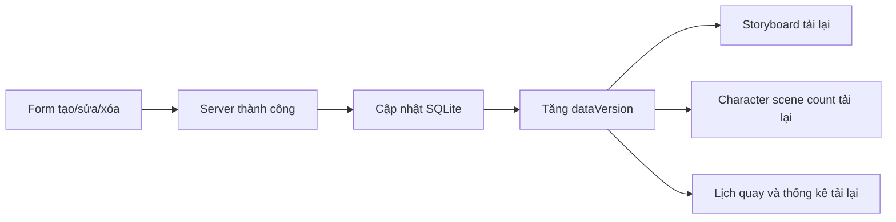

# Kiểm tra dữ liệu cố định và khả năng tự làm mới

Ngày kiểm tra: 22/07/2026  
Phạm vi: ứng dụng Flutter tại `CineX_PRM_Project`.

## 1. Các lỗi đã xử lý

| Khu vực | Nguyên nhân | Cách xử lý | Trạng thái |
|---|---|---|---|
| Project - tiến độ sản xuất | Màn Project và màn Production lấy trạng thái từ nhiều nguồn khác nhau; một số thống kê dùng danh sách đang nhóm/lọc thay vì toàn bộ dữ liệu | Thống nhất nguồn trạng thái quay từ `ProductionPlan`; đọc SQLite trước rồi làm mới từ API; số cảnh, nhân vật và bối cảnh lấy từ dữ liệu thật của dự án | Đã sửa |
| Production - thống kê | Số bối cảnh phụ thuộc chế độ gom nhóm và có khối tiến độ bị lặp | Đếm `locationId` duy nhất trên toàn bộ cảnh, chỉ giữ một khối tiến độ, dùng trạng thái quay đã lưu | Đã sửa |
| Character - sửa nhân vật luôn hiện 2 cảnh | `_AppearsInScenesSection` chứa cố định `SCENE 12A` và `SCENE 15` | Xóa dữ liệu minh họa; tải danh sách cảnh của đúng project từ SQLite/API rồi lọc theo Character ID | Đã sửa |
| Character/Location detail | Khi API lỗi, màn hình thay bằng cảnh từ `MockData`, tạo cảm giác dữ liệu thật bị sai | Bỏ toàn bộ fallback `MockData`; dùng cache SQLite của đúng project và trạng thái rỗng khi không có dữ liệu | Đã sửa |
| Scene - sửa nhân vật nhưng trang khác chưa đổi | Các provider không phát tín hiệu thay đổi dữ liệu liên miền | Thêm `dataVersion` cho Scene/Character/Location; Storyboard, Character list và Production tự tải lại khi phiên bản thay đổi | Đã sửa |
| Scene status | Cache SQLite chưa được cập nhật sau thao tác đổi trạng thái nhanh | Ghi scene trả về từ server vào SQLite và phát tín hiệu invalidation | Đã sửa |
| Production - ngày quay/trạng thái | UI có thể thông báo thành công dù PUT backend thất bại | Chỉ cập nhật UI/cache và báo thành công sau khi server trả thành công; lỗi/timeout được hiển thị | Đã sửa |
| Lịch quay và export | Bối cảnh chưa có ngày từng bị gán ngày giả theo ngày bắt đầu project | Không tạo ngày giả; hiển thị `CHƯA XẾP NGÀY` và đặt cuối danh sách | Đã sửa |
| API thùng rác/thông báo | Lỗi API từng bị thay bằng dữ liệu demo, che giấu lỗi thật | Không trả `MockData`; response rỗng là danh sách rỗng, HTTP lỗi được truyền lên UI | Đã sửa |
| Tạo Project | Poster chưa chọn từng được lưu thành URL placeholder | Không lưu URL giả; chỉ lưu URL upload thật hoặc URL hiện có khi sửa | Đã sửa |
| Location list cũ | Dùng cố định project `101` | Bắt buộc truyền `projectId` thật | Đã sửa |
| Project - ngày bắt đầu/kết thúc | Chuyển 00:00 local sang UTC làm ngày bị lùi một ngày | Dùng serializer ngày lịch `yyyy-MM-ddT00:00:00`, không chuyển UTC; parser chỉ lấy phần ngày | Đã sửa |
| Scene mới chưa xuất hiện trong Production | POST chỉ trả ID và cache không suy ra được project | GET lại Scene có expand sau khi tạo, lưu cache theo project và refresh Production khi đổi tab | Đã sửa |
| Gom lịch theo bối cảnh | Danh sách trong group chỉ sort theo DAY/NIGHT nên phụ thuộc thứ tự API/tạo | Sort theo `Scene.compareNumbers`, sau đó mới dùng DAY/NIGHT làm tie-breaker | Đã sửa |
| Notification title | Nhiều nơi truyền tên giả `Dự án CineX #id` | Provider tự resolve title thật từ SQLite/API; các call site không còn truyền title giả | Đã sửa |
| Notification offline | Chưa có cache và thao tác đọc có thể cập nhật UI trước server | Thêm bảng SQLite version 3 theo từng username; đọc cache trước, ghi trạng thái sau server thành công | Đã sửa |
| Location offline image | Fallback `placehold.co` phụ thuộc mạng | Dùng placeholder UI cục bộ của `ImageCard` | Đã sửa |
| Auth offline | Tài khoản mẫu và mật khẩu rõ trong SharedPreferences | Xóa credential store cũ; offline chỉ khôi phục phiên/token đã đăng nhập hợp lệ | Đã sửa |

## 2. Luồng tự làm mới hiện tại

- Luồng ghi vẫn là `server thành công -> SQLite -> UI`; không phát sinh offline write hoặc conflict ngầm.
- Luồng đọc là `SQLite -> API`; dữ liệu cache xuất hiện nhanh, sau đó được thay bằng dữ liệu mới từ server.
- Khi Scene thay đổi nhân vật/bối cảnh/trạng thái, các màn liên quan không còn yêu cầu thoát project rồi vào lại.

## 3. Kết quả audit hard-code sau khi xử lý

Đã quét lại runtime bằng `rg`. Không còn import hoặc sử dụng `MockData`, không còn `SCENE 12A/SCENE 15`, `Dự án CineX #id`, `placehold.co`, tài khoản `writer123/producer123` hay project ID cố định `101`.

Các hằng số còn lại đều là hằng số giao diện/kỹ thuật hợp lệ: enum trạng thái, màu biểu đồ, giới hạn phân trang, label UI và migration legacy một lần của ProductionPlan.

`lib/data/mock_data.dart` đã được xóa khỏi project.

### Hợp lệ, không phải dữ liệu nghiệp vụ cố định

- Danh sách enum thể loại, trạng thái, role, INT/EXT, DAY/NIGHT.
- Màu biểu đồ, giới hạn phân trang và label giao diện.
- `SharedPreferences` trong `ProductionProvider` chỉ phục vụ nhập dữ liệu lịch quay cũ một lần; nguồn chuẩn mới là PostgreSQL và bản sao SQLite.

## 4. Điều kiện để tiến độ/lịch quay hoạt động trên production

Frontend đang gọi:

- `GET /api/projects/{projectId}/production-plan`
- `PUT /api/projects/{projectId}/production-plan`

Backend trong workspace đã có controller, model và migration `AddProductionPlans`. Endpoint Render hiện trả `401` khi gọi không có JWT, nghĩa là route đã được deploy và middleware xác thực đang hoạt động; đây không còn là lỗi thiếu endpoint. Cần kiểm tra lần cuối bằng JWT hợp lệ: `GET` phải trả `200`, sau đó Producer thử `PUT` để xác nhận bảng đã được migration.

Không thêm fallback ghi local để che lỗi server; PostgreSQL vẫn là nguồn chuẩn và SQLite chỉ là bản sao đọc offline.

## 5. Checklist smoke test

1. Mở sửa Character chưa gán scene: phải hiện `Nhân vật chưa được gán vào cảnh nào`, không hiện hai scene demo.
2. Gán/bỏ Character trong Scene, lưu thành công: Storyboard, số cảnh ở Character và Production phải đổi mà không thoát project.
3. Đổi trạng thái quay Scene sang `Đã quay xong`: tiến độ và số `Đã quay` phải đổi ngay sau response PUT thành công.
4. Đổi ngày quay: tải lại ứng dụng/thiết bị khác vẫn thấy cùng ngày.
5. Bối cảnh chưa có ngày nằm cuối và hiện `CHƯA XẾP NGÀY` trên UI lẫn export.
6. Tắt mạng sau khi đã đồng bộ: Producer và Screenwriter xem/lọc được dữ liệu SQLite; các nút ghi không được báo thành công giả.

## 6. Kết quả kiểm tra đóng dự án

- Dart analyzer: không có error/warning; còn 33 thông tin lint mức `info` (print cũ, API deprecated, web-only library và style).
- Flutter test: 19/19 test đạt.
- Flutter Web build: `build/web` tạo thành công.
- `git diff --check`: không có lỗi whitespace.
